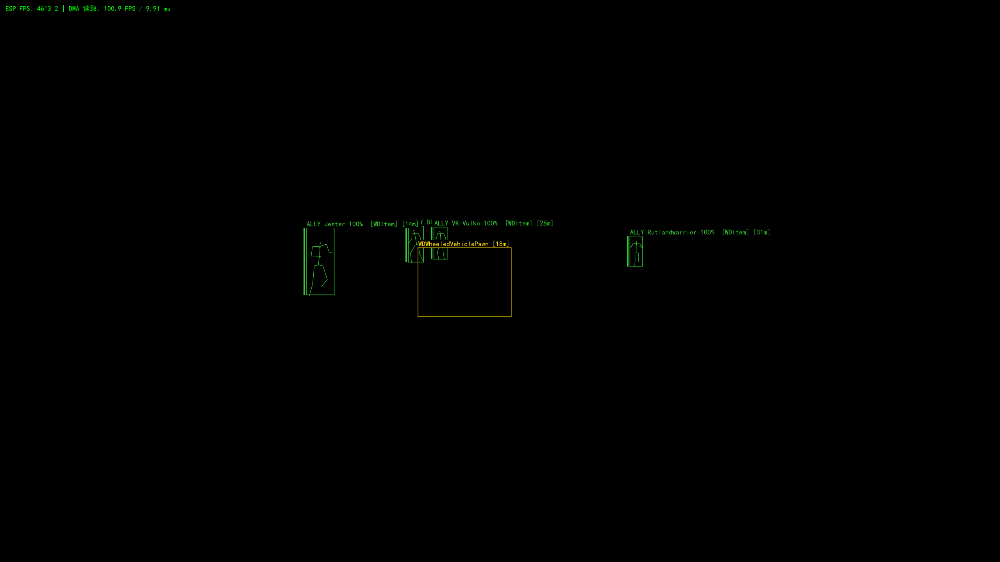
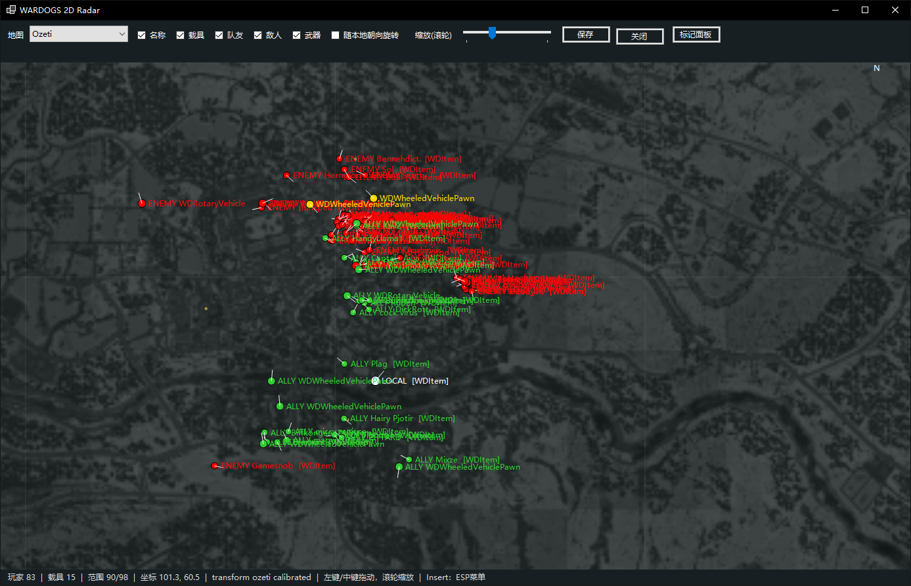

# WARDOGS DMA

> **免责声明 / Disclaimer**：本项目仅用于技术交流、学习和授权测试。请勿将本项目用于违法用途、未授权访问、破坏他人系统或违反游戏/平台服务条款的行为。使用者须自行承担使用本项目产生的全部责任。

## 中文（默认）

WARDOGS DMA 是一个面向 Windows x64 的只读 DMA 游戏数据可视化工具，使用 Vmmsharp 读取 `WardogsClient-Win64-Shipping.exe` 的运行时对象，并通过独立窗口展示实时态势。项目不会向目标进程写入内存。

### 功能

- **DMA 数据读取**：读取 UE 世界、关卡、GameState、玩家和载具对象，后台刷新目标快照。
- **全屏 ESP 覆盖层**：透明点击穿透窗口，显示玩家/载具框、名称、距离、阵营、血量、倒地状态和手持武器。
- **玩家骨骼**：根据运行时网格姿态和骨骼层级投影骨骼线，避免使用固定静态姿势。
- **阵营识别**：通过 PlayerState、FactionComponent 和 GenericTeamId 区分队友、敌人和未知目标。
- **载具识别**：扫描 UE 全局对象和关卡数组，支持载具阵营、占用者以及车辆名称显示。
- **2D 雷达**：独立 `WARDOGS 2D Radar` 窗口，支持 Bakurani、Ozeti、Zestafona 地图、缩放、拖动、朝向旋转、名称/载具/队友/敌人/武器过滤和地图标记。
- **迫击炮 / 火炮计算**：在雷达上添加标点，以本地位置为炮位，计算距离、方位角以及 L81、SPH-2 的低/高射角 mil。
- **地图资源**：读取地图边界、校准变换、出生区和固定标记；底图瓦片按需从地图配置指定的服务加载，并使用本地缓存。
- **诊断与配置**：命令行支持单次诊断、名称池探针、设备初始化控制和目标进程选择；菜单配置会保存到 `wardogs-esp.json`。

### 截图

#### ESP 覆盖层



#### 2D 雷达与迫击炮标记



### 目录结构

```text
Program.cs              主程序、DMA 读取、ESP/雷达窗口和迫击炮计算
Offsets.cs              目标版本的 UE 字段和骨骼布局
WardogsReader.csproj    .NET 8 Windows x64 项目配置
WardogsReader.slnx      Visual Studio 解决方案
data/weapons.json       迫击炮/火炮弹道数据
maps/*.json             地图边界、标记、校准和瓦片服务配置
screenshots/            项目截图
```

### 构建

需要 .NET 8 SDK 和 Windows x64 环境：

```powershell
dotnet restore .\WardogsReader.csproj
dotnet build .\WardogsReader.csproj -c Release
```

输出目录为 `bin\Release\net8.0-windows8.0\win-x64`。本仓库不提交 VMM/LeechCore 等原生运行库；运行前请将与你的 Vmmsharp/设备环境匹配的原生依赖放到可执行文件旁边。NuGet 依赖会由 `dotnet restore` 自动获取。

### 运行

建议从输出目录启动：

```powershell
.\WardogsReader.exe --device fpga --no-wait
```

可选参数：`--process NAME`、`--device NAME`、`--no-wait`、`--name-sample`、`--once`。运行时按 **Insert** 打开 ESP 菜单；独立雷达窗口支持地图切换、缩放和标记面板。

### 目标版本与兼容性

`Offsets.cs` 中的地址和类索引对应特定的 Wardogs 客户端构建。游戏更新后需要重新确认全局对象、类层级、相机、玩家状态、载具和骨骼字段，否则读取结果可能为空或不准确。

### 许可证

本项目采用 [MIT License](LICENSE)。第三方 NuGet 包、VMM/LeechCore 原生库、地图瓦片和游戏数据仍受其各自许可证或服务条款约束。

---

## English

WARDOGS DMA is a read-only Windows x64 DMA visualization tool. It uses Vmmsharp to read runtime objects from `WardogsClient-Win64-Shipping.exe` and presents a live view through separate overlay and radar windows. It does not write memory to the target process.

### Features

- **DMA data reader**: Reads UE world, levels, GameState, player, and vehicle objects with background snapshot refresh.
- **Fullscreen ESP overlay**: Click-through overlay showing player/vehicle boxes, names, distance, faction, health, downed state, and held weapons.
- **Player skeletons**: Projects runtime mesh poses and bone hierarchies instead of relying on a fixed rest pose.
- **Faction classification**: Uses PlayerState, FactionComponent, and GenericTeamId to distinguish allies, enemies, and unknown contacts.
- **Vehicle discovery**: Scans UE global objects and level arrays, including vehicle faction, occupants, and labels.
- **2D radar**: Independent `WARDOGS 2D Radar` window with Bakurani, Ozeti, and Zestafona maps; zoom, pan, heading rotation, filters, labels, and markers.
- **Mortar / artillery calculator**: Add map markers and calculate distance, bearing, and low/high elevation mil for L81 and SPH-2 ballistic tables.
- **Map resources**: Loads map bounds, calibrated transforms, spawn zones, and fixed markers; map tiles are fetched on demand and cached locally.
- **Diagnostics and settings**: Command-line diagnostics, FName probing, device initialization options, process selection, and persistent `wardogs-esp.json` settings.

### Screenshots


### Build and run

Requires the .NET 8 SDK and Windows x64:

```powershell
dotnet restore .\WardogsReader.csproj
dotnet build .\WardogsReader.csproj -c Release
.\WardogsReader.exe --device fpga --no-wait
```

Native VMM/LeechCore runtime libraries are intentionally not committed; place versions matching your Vmmsharp/device setup beside the executable before running. Press **Insert** to open the ESP menu. The radar window supports map selection, zoom, filters, heading rotation, and the marker panel.

### Target build compatibility

The addresses and class indices in `Offsets.cs` target a specific Wardogs client build. After game updates, re-check UE globals, class hierarchies, camera, PlayerState, vehicle, and skeleton fields.

### License and disclaimer

Released under the [MIT License](LICENSE). Third-party packages, native libraries, map tiles, and game data remain subject to their respective licenses or service terms. This project is provided for technical exchange, learning, and authorized testing only; do not use it for unlawful or unauthorized activity.
